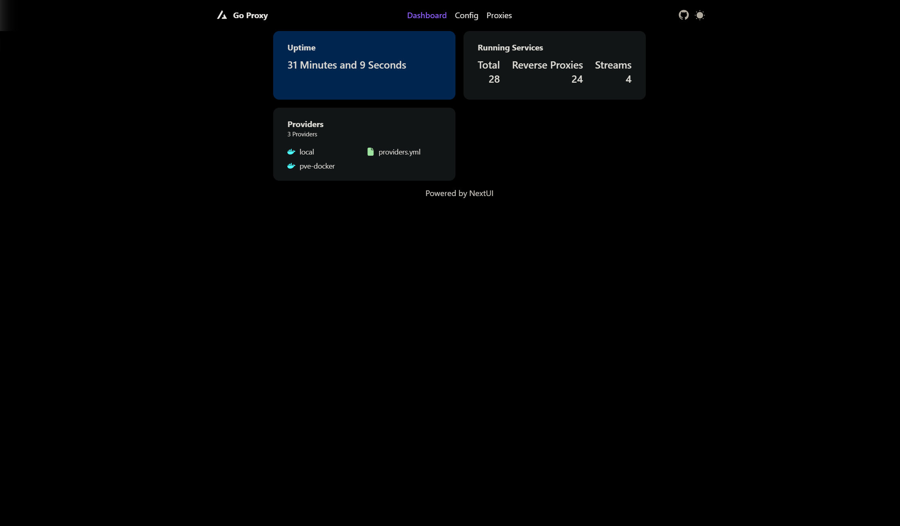
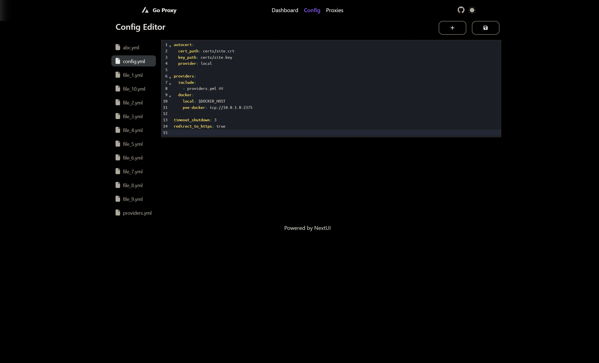
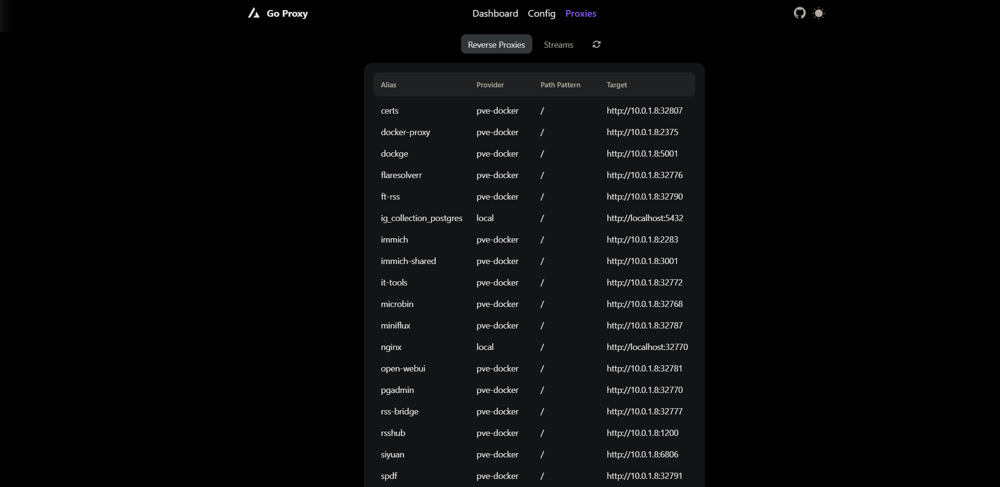

# Next.js & NextUI Template

This is the frontend for [go-proxy](https://github.com/yusing/go-proxy), created using Next.js 14 (app directory) and NextUI (v2).

## Screenshots

## Technologies Used

- [Next.js 14](https://nextjs.org/docs/getting-started)
- [NextUI v2](https://nextui.org/)
- [Tailwind CSS](https://tailwindcss.com/)
- [Tailwind Variants](https://tailwind-variants.org)
- [TypeScript](https://www.typescriptlang.org/)
- [Framer Motion](https://www.framer.com/motion/)
- [next-themes](https://github.com/pacocoursey/next-themes)

## License

Licensed under the [MIT license](https://github.com/nextui-org/next-app-template/blob/main/LICENSE).
